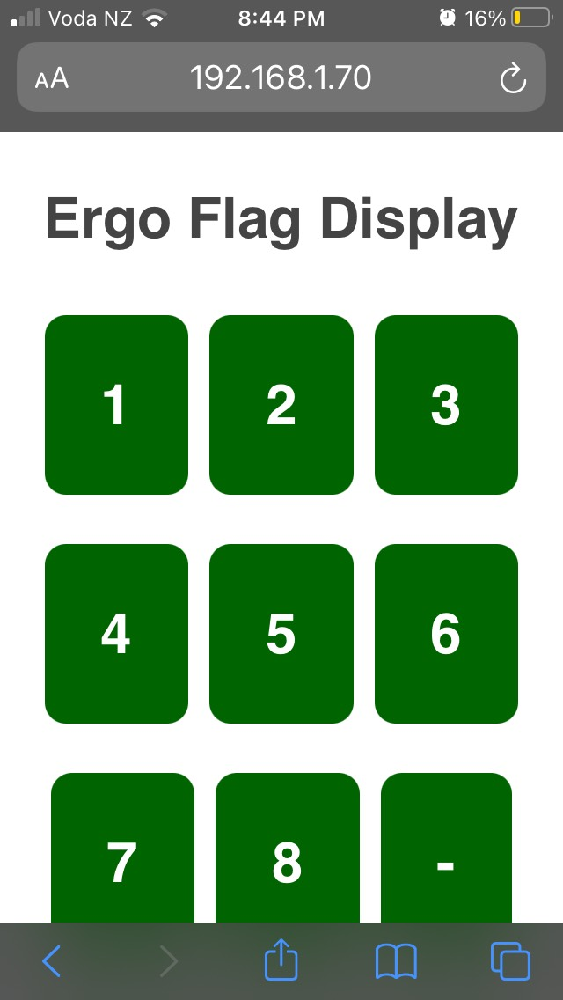

This reposistory contains code for an ESP-8266 Arduino Sketch (.ino file) that presents a simple web interface containing 8 buttons which enable 8 different digital output pins. These pins are designed to drive a hardware switch, which in turn drives the solenoids of a flag relay device.

The code is compiled and uploaded to a Lolin D1 mini ESP-8266 device, using the Arduino IDE.

# Prerequisites
- Wifi 803.11g, 2.4GHz (ESP-8266 does not support 5 Ghz)
- SSID and Password
- Access to admin console of the Wifi Router

# Setup

## Connect to Local Wifi.

Follow these instructions to connect the Flag Relay system to a 2.4 GHz Wifi. This is needed when connecting to Wifi for the first time, or if the device has been previously connected to a network, then these instruction show how to change the Wifi network.

### Clear any previous Wifi credentials stored in Flash memory
These instructions work on a Windows PC only.

Any previous credential stored in the ESP-8266 flash, will be used to automatically connect to the network. If these details are incorect because they have changed or the device needs to be connected to a new network, the old credentials must been first deleted, and the new details saved.

- Download the [Espressif Flash Download tool](https://www.espressif.com/en/support/download/other-tools) for Windows
- Open the flag relay box and connect the computer to the ESP-8266 using a data-capable USB cable
- Find the COM used for the serial communications by opening the Device Manager `devmgmt.msc` control panel and inspecting the Ports setting. If the COM port is not showing, you need to install the `CH340` Serial Device Driver.
- Run the `Flash Download tool`, set the correct COM Port
- Load the [Dummy 1MB file](readme/blank_1MB.bin) (see image)
- Click `Erase`. It will take 5 seconds to complete.

### Upload the ESP Application and Configure Wifi

Wifi connection to the ESP uses the AutoConnect library. The instructions on this page are taken from [these instructions](https://github.com/Hieromon/AutoConnect/blob/master/mkdocs/gettingstarted.md) to connect.

- Using the Arduino IDE
    - open the file `esp-flag-relay/esp-flag-relay.ino`,
    - set the `Board` setting to `LOLIN WEMOS D1 R2 & mini`.
    - set the COM Port and upload  Baud rate
    - Compile and Upload the `esp-flag-relay.ino` Sketch to the board
    - When upload is completed the onboard Blue led will blink 4 times and then remain on - this indicates that the sketch is running

- The flag relay will now operate as an access point. Using a wifi device (e.g. a phone), list the local wifi networks. Connect to the network called `esp8266ap`. It may take a couple of minutes for this network to appear. The password is `12345678`. A login page should appear. Otherwise browse to the login page using the url `http://ESP8266IPADDRESS/_ac`

- Click the hamburger menu, and then select `Configure new AP`

- Select the local 2.4 GHz Wifi network from which to control the Flag Relay.
- Enter credentials to connect to the Wifi network, and click `Apply`.
- Click the hardware reset button, to re-run the sketch, but this time it will connect to the wifi network that was just set up.
- On the phone, reconnect to the wifi network that was just set up
- Log into the administration page of the wireless router or Access Point for the wifi network. Find the DHCP address that was assigned to the Flag Relay.
- Browse to that IP Address on a web browser, and you should see the Button Panel to control the Flag Relay.
- Pressing one of the buttons will trigger the flag on the Flag Relay. You need to mechanically reset the Flag directly on the Flag Relay device - reset cannot be performed remoted.

# Running the Flag Relay

After connecting the power to the Flag Relay, the Reset  Button must be pressed on the ESP-8266 board, in order for it to start running.

# Software Notes

- AutoConnect library, to manage Wifi connection for the ESP-8266 
- HTML page sends raw HTML to the `ESP8266WebServer`. The button panel is simple and does not require HTML libraries.

# Hardware Notes

- ESP-8266 Micro controller, selected because it support 802.11g Wifi, and has 8 Digital Output Pins
- Output stage uses `TIP-120` Darlington transistors to switch the current to each solenoid in the Flag Relay. These are cheaper to use than hardware relays
- Power supply is 22V (positive centre), which is required by the Flag Relay solenoids. The same power supply is reduced to 3.3V using a Buck Voltage Converter

# Circuit Diagram

Circuit diagram drawn by https://www.circuit-diagram.org/
